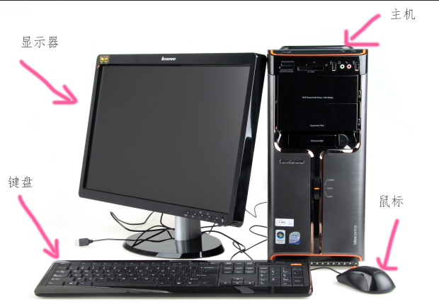
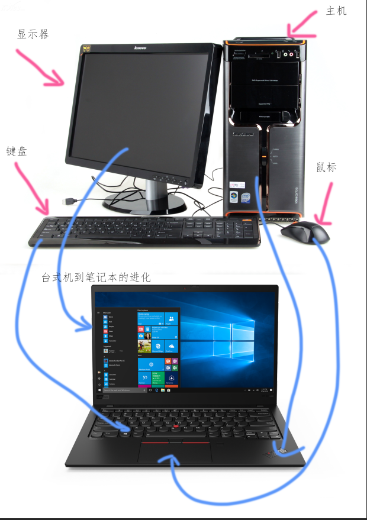
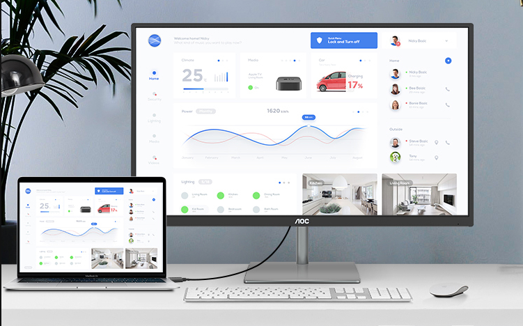
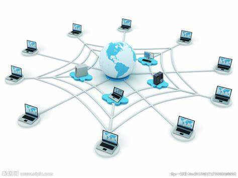
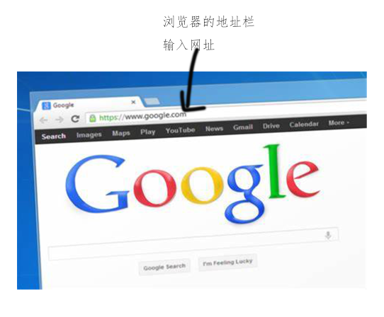

# 给阿木的电脑入门知识

## 电脑分类

- 台式机

  - 台式机通常由主机、显示器、键盘、鼠标组成

  

  - 台式机是可以接多个显示器的，这些显示器上可以同时显示相同或不同的画面

- 笔记本

  - 又叫笔记本电脑、手提电脑

  - 由于技术的进步，能够把大大的台式机装进小小的盒子，台式机就进化成了笔记本

    

    - 笔记本也可以外接一个显示器，这样能看到更大的画面，提升效率。1 千块的显示器已经很好了，相比几千的笔记本，不算贵。

      

    - 当然笔记本也可以外接键盘和鼠标

    - 笔记本使用时需要注意散热，不要挡住散热风的口。

- 手机

  - 没错，手机其实也算电脑的一种，比笔记本做的更小，未来会有越来越小的电脑
  - 手机上的键盘就是屏幕上的触摸键盘，用触摸屏代替了鼠标
  - 当然大部分手机也是可以外接键盘和鼠标的，只是很少有人这么做而已

- 台式机虽然不方便携带，但往往拥有更强大的性能；笔记本如果需要达到一样的性能，价格要贵很多。

## 网络

- 电脑也好手机也好，离开了网络功能都大大的受限，基本不能做些什么

- 那么什么是网络呢，简单的理解，就是用网线把大家的电脑都连接在一起的东西。

- 那手机为什么不需要网线也能上网呢？因为有无线 WiFi 呀，笔记本也可以用 WiFi，只要能上网，就是跟其他人的电脑都连接在一起了的

- 总之，现在全世界的手机、电脑都连接在一个叫做网络的东西上，这个网络由网线、WiFi、卫星等等组成。

  

- 那平时上网看的文字、图片、视频都放在什么地方呢？

  - 放在服务器上，服务器又是什么？服务器就理解是比普通电脑贵、性能又非常好的特殊电脑
  - 服务器也连接在网络上，服务器上放的文字、图片、视频等，就可以通过网络传输到大家的电脑、手机上看了

- 浏览器

  - 浏览器是一个用来上网的软件，在地址栏输入一个网址，就可以看这个网站上的东西

  - 可以简单的理解，访问不同的网址就是访问不同的服务器上的东西

  - 在浏览器上点击了一个按钮，其实就是浏览器转去访问了这个按钮绑定的网址罢了

    

- 那手机上的 APP 或者电脑上的其他软件跟浏览器有什么区别呢，为什么也能上网呢？
  - 可以把他们理解成特殊的浏览器，特殊在他们只能上特定的网站，你没得选择。
  - 有很多 APP 或者软件的主要功能不是上网的，比如 PS，是用来做设计的。

- 我的手机、电脑上有很多图片、视频资料，也连上了网络，是不是别人也可以看到？
  - 正常情况下别人是看不到的
  - 想让你电脑上的资料让别人看到，或者共享给别人，这时候你的电脑就相当于一个服务器了，是需要一些专业知识的。
  - 还有一种就是黑客，如果你的电脑中毒了，就是安装了专门搞破坏的软件，或者上了带有病毒的网址，黑客就可能拿到或者销毁你电脑上的资料

## 电脑病毒

- 专门搞破坏（偷资料、破坏资料）的软件程序
- 可以通过光盘、U 盘、盗版软件、不良网站传播
- 如何防病毒？
  - 现在的电脑一般不用光盘了，所以光盘传播就基本不用担心
  - U 盘在学校里使用得比较多，如果别人的电脑上有病毒，你的 U 盘插入他的电脑，U 盘就可能带有病毒，U 盘再插到自己的电脑上的时候，自己的电脑就可能中毒。你的 U 盘再插入第三个人的电脑，那么他的电脑也可能中毒了。如何防护？
    - 减少 U 盘的使用，通过网络传输资料
    - 安装杀毒软件，这里推荐[火绒杀毒软件](https://www.huorong.cn/prod.html)
  - 不安装来路不明的软件、盗版软件，到官方网站下载安装
- 重要资料进行备份。其实重要的不是你的电脑、手机，而是上面的资料。电脑、手机坏了，可以再买，但是作品、照片不见了，是用钱买不回来的。所以资料要有备份，重要的资料甚至可以备份多份。如何备份呢？
  - 把资料存在一个 U 盘上，U 盘坏了，电脑上还有；电脑坏了，U 盘上还有。看重要程度，可以存在多个 U 盘上。
  - 把资料存到网络服务器上。比如这里推荐两个工具，[石墨文档](https://shimo.im/pricing/personal)、[百度网盘](https://pan.baidu.com/)。他们都有手机 APP 和电脑软件，浏览器也能用，资料上传上去后，不管手机还是电脑，都能看到最新的。
    - 石墨文档，甚至能让你跟同学一起同时写一个文档，她写第一段你写第三段，她在自己手机电脑上写的你能实时看到。
    - 百度网盘，一般用来上传保存比较大的文件，比如视频、照片等
- 密码安全
  - 开电脑、登录网站、APP如微信、银行卡取钱，一般都需要密码，可见密码的重要性
  - 如何设置密码？
    - 越重要的密码需要越复杂，越长的密码越复杂、越没有顺序没有意义的越复杂、大小写字母和数字混在一起更复杂
    - 不要使用单纯的数字做密码
    - 不要使用拼音、生日等容易被别人猜到的作为密码
    - 不要所有东西都用同一个密码，不然别人知道了你微信的密码，银行卡的密码也被知道了。
    - 一段时间之后要更新密码，三个月或者一年，越重要就更新越频繁
  - 密码这么复杂，自己记不住怎么办？
    - 推荐看看这个人的说法吧。[[建立一套属于自己的密码体系](https://www.isharepc.com/2939.html)](https://www.isharepc.com/2939.html)

## 推荐一些学习网站

- B 站 https://www.bilibili.com/ ，不要光看动画呀，这网站上也有很多教学类视频
- 知乎 https://www.zhihu.com/
  - [知乎产品设计话题](https://www.zhihu.com/search?type=content&q=产品设计)
  - [知乎产品经理话题](https://www.zhihu.com/search?type=content&q=产品经理)
- 网易云课堂 https://study.163.com/
- 网易公开课 https://open.163.com/
- 腾讯课堂 https://ke.qq.com/
- 慕课网 https://www.imooc.com/
- 51自学网 https://www.51zxw.net/
- doyoudo https://www.doyoudo.com/
- 也有一些国外的网站，还可锻炼锻炼英语
  - 美国斯坦福大学主导的学习平台 [coursera.org/browse](https://www.coursera.org/browse)
  - 麻省理工和哈佛大学主导 [edx.org/course](https://www.edx.org/course)
  - 英国的第一个MOOC平台 [futurelearn](https://www.futurelearn.com/)